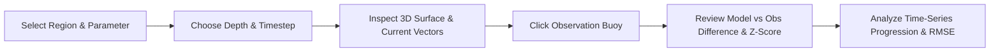

<div align="center">

# 🌊 Ocean3D — Interactive Ocean Digital Twin

**A web-based 3D ocean visualization and analytical platform for exploring modeled ocean states alongside simulated in-situ observations.**

[](https://react.dev/)
[](https://www.typescriptlang.org/)
[](https://threejs.org/)
[](https://fastapi.tiangolo.com)
[](https://www.python.org/)
[](https://tailwindcss.com/)

</div>

---

## 🧭 Why Ocean3D?

Ocean circulation models provide continuous, high-resolution spatial grids of the marine environment, while in-situ platforms (such as moored ocean buoys, profiling floats, and coastal stations) supply localized ground-truth measurements. 

Because modeled outputs and empirical observations frequently diverge due to atmospheric forcing, freshwater influx, and sub-grid mesoscale eddies, oceanographers and environmental analysts need intuitive ways to evaluate model fidelity.

**Ocean3D** bridges this divide by co-visualizing dense spatial model fields with sparse in-situ observation markers within an interactive WebGL 3D environment. It performs dynamic difference calculations ($\text{Observed} - \text{Model}$), runs deterministic statistical $Z$-score anomaly detection, and plots temporal progressions to highlight physical deviations across basin depths and forecast intervals.

---

## 🔍 Project Overview

Ocean3D provides a unified digital twin workspace structured around exploration, depth stratification, and residual comparison:

- **Interactive 3D Ocean Canvas**: Fully interactive WebGL globe and regional basin viewer powered by Three.js, supporting orbit, pan, zoom, and nadir perspective presets.
- **Geographic Basin Selection**: Switch effortlessly between the **Bay of Bengal**, **Arabian Sea**, **North Indian Ocean Basin**, and a macro **Global Overview**.
- **Physical Ocean Parameters**: Multi-variable spatial fields including Sea Surface Temperature (SST), Salinity, Sea Surface Height (SSH), and Current Velocity.
- **Vertical Depth Stratification**: Slice the water column across discrete depths ($0\,\text{m}$, $10\,\text{m}$, $50\,\text{m}$, $100\,\text{m}$, and $500\,\text{m}$).
- **4D Temporal Evolution**: Step through 10 distinct 6-hour forecast timesteps or play continuous temporal loops.
- **In-Situ Station Telemetry**: Raycast-inspect moored buoys and profiling floats anchored at real geographic coordinates.
- **Model vs. Observation Analytics**: Instant side-by-side analytical comparisons with mathematical difference calculations.
- **Residual & Anomaly Visualization**: Diverging color scales and pulsing beacon rings displaying localized statistical deviations.
- **Decision-Support Advisories**: Parameter-aware environmental summaries translating physical divergences into structured monitoring insights.

---

## ⚡ Core Features

| Feature | Description | Implementation Status |
|---|---|:---:|
| **Interactive 3D Ocean** | Three.js WebGL viewport with particle grids, stylized coastlines, and orbit navigation | Built & Verified |
| **Region Selection** | Instant geographic bounds and camera focus switching across 4 ocean domains | Built & Verified |
| **Physical Parameters** | Turbo SST, Viridis Salinity, Coolwarm SSH, and Plasma Current fields | Built & Verified |
| **Depth Stratification** | Water column navigation from surface ($0\,\text{m}$) to bathypelagic ($500\,\text{m}$) | Built & Verified |
| **Temporal Navigation** | 10 simulation timesteps (6-hour deltas) with playback looping and step scrubbing | Built & Verified |
| **In-Situ Inspection** | 3D moored buoys and profiling floats with interactive click-and-hover raycasting | Built & Verified |
| **Model vs. Observation** | Real-time calculation of analytical differences ($\text{Observed} - \text{Model}$) | Built & Verified |
| **Difference Visualization** | Diverging residual color scale (Cool Blue $\to$ Neutral White $\to$ Warm Red) | Built & Verified |
| **$Z$-Score Anomaly Detection**| Deterministic statistical classification into Normal, Moderate, and Significant tiers | Built & Verified |
| **RMSE & Metric Cards** | Live computation of Root Mean Square Error, basin minimums, maximums, and means | Built & Verified |
| **Current Flow Vectors** | Directional, animated 3D vector arrows scaled to $(u, v)$ velocity components | Built & Verified |
| **Risk Decision Support HUD** | Compact floating glassmorphic advisory banner anchored over the 3D canvas | Built & Verified |
| **Collapsible Side Drawers** | Expandable/collapsible control panel and location inspector maximizing 3D area | Built & Verified |
| **Built-in Demo Flow** | One-click preset configuring an illustrative Bay of Bengal thermal anomaly scenario | Built & Verified |

---

## 🌊 Physical Parameters

Ocean3D models and visualizes four primary oceanographic physical variables:

1. **Sea Surface Temperature (SST)** — `°C`
   - *Description*: Represents the thermal structure and heat content of the upper ocean layer ($10.0$ to $34.0\,^\circ\text{C}$).
   - *Colormap*: Turbo thermal gradient (Navy $\to$ Cyan $\to$ Yellow $\to$ Crimson).
2. **Salinity** — `PSU` (Practical Salinity Units)
   - *Description*: Reflects salt concentration, riverine freshwater plumes, and evaporation zones ($28.0$ to $38.0\,\text{PSU}$).
   - *Colormap*: Viridis gradient (Deep Blue $\to$ Teal $\to$ Bright Yellow).
3. **Sea Surface Height (SSH)** — `m`
   - *Description*: Dynamic sea level topography, altimetry anomalies, and mesoscale eddy circulation ($-0.40$ to $+0.60\,\text{m}$).
   - *Colormap*: Coolwarm diverging gradient.
   - *Constraint*: **SSH is strictly a 2D surface variable.** In Ocean3D, selecting SSH automatically locks depth stratification to $0\,\text{m}$ (surface level). Non-surface depth buttons are cleanly disabled with an explanatory tooltip.
4. **Current Velocity** — `m/s`
   - *Description*: Horizontal water velocity and kinetic energy ($0.0$ to $2.2\,\text{m/s}$).
   - *Colormap*: Plasma gradient with dynamic $(u, v)$ directional vector arrows.

---

## 🎮 3D Visualization Capabilities

The Three.js viewport provides fluid, scientific spatial exploration:

- **Orbit Controls**: Left-click to rotate around the geographic focal point, right-click to pan, and scroll wheel to zoom ($3\times$ to $50\times$ distance limits).
- **Camera Viewport Presets**: Instant reset to standard oblique perspective ($45^\circ$) or a top-down nadir bathymetry view via the floating camera HUD.
- **Procedural Geographic Contours**: Extruded terrain geometry for the Indian peninsula, Sri Lanka, Andaman & Nicobar archipelago, Southeast Asian coasts, and the Arabian rim with glowing shoreline contours.
- **Reference Lat/Lon Grid**: Coordinate graticule lines ($5^\circ$ grid) anchoring regional spatial dimensions.
- **Depth-Displaced Particle Mesh**: Dense numerical grid vertices displaced in elevation according to active depth slice and dynamic sea level height.
- **Raycasted Observation Buoys**: 3D float geometries with antenna masts and blinking beacons. Clicking any buoy focuses the inspection panel on that station's exact telemetry.
- **Dynamic Current Velocity Field**: Subsampled velocity arrows animating along local $u$ (zonal) and $v$ (meridional) vectors, cycling continuously.

---

## 📊 Analytical Methodology

### 1. Model vs. Observation Comparison

At every in-situ observation point, Ocean3D calculates the analytical residual:

$$\text{Difference} = \text{Observed Value} - \text{Model Value}$$

#### Residual Interpretation:
- **Positive Difference ($\text{Difference} > 0$)**: The empirical observation exceeds the numerical model guidance ($\text{Observed} > \text{Model}$). In temperature fields, this indicates a warm anomaly or model underprediction.
- **Negative Difference ($\text{Difference} < 0$)**: The empirical observation is lower than the model forecast ($\text{Observed} < \text{Model}$). In salinity fields, this indicates freshwater dilution or halocline freshening.
- **Zero Difference ($\text{Difference} \approx 0$)**: Perfect alignment between model guidance and telemetry.

```
Example (Station RAMA-BD02 at 10m Depth):
  Numerical Model Value:  28.02 °C
  In-Situ Observed Value: 30.52 °C
  ─────────────────────────────────
  Calculated Difference:  +2.50 °C  [Positive Residual / Warm Anomaly]
```

---

### 2. Statistical $Z$-Score Anomaly Detection

To determine whether a residual constitutes statistical noise or a significant physical anomaly, Ocean3D computes a normalized $Z$-score against regional baseline standard deviation ($\sigma_{\text{baseline}}$):

$$Z = \frac{\text{Difference}}{\sigma_{\text{baseline}}} = \frac{\text{Observed} - \text{Model}}{\sigma_{\text{baseline}}}$$

#### Severity Thresholds:
- **$|Z| < 1.5$ &rarr; `NORMAL` (Emerald Green)**: Telemetry is within baseline tolerance; model guidance and observation are in agreement.
- **$1.5 \le |Z| < 2.5$ &rarr; `MODERATE DEVIATION` (Amber)**: Localized divergence; warrants observation tracking and spatial monitoring.
- **$|Z| \ge 2.5$ &rarr; `SIGNIFICANT ANOMALY` (Crimson Red)**: High-confidence physical anomaly; highlighted with pulsing 3D radar beacons and prominent advisory cards.

---

### 3. Root Mean Square Error (RMSE)

Overall regional model fidelity is quantified across all $N$ matched in-situ observation points:

$$\text{RMSE} = \sqrt{\frac{1}{N} \sum_{i=1}^{N} \left( \text{Observed}_i - \text{Model}_i \right)^2}$$

RMSE provides a single benchmark index indicating the average magnitude of numerical forecast error across the active basin stratum.

---

## 🛡️ Data Transparency & Model Origin

> ### ⚠️ Prototype Data Disclosure
> **Ocean3D currently operates using deterministic, physics-informed synthetic ocean model data and simulated in-situ observations.**
>
> - Spatial grids are calculated dynamically using oceanographic parameter functions (exponential thermocline decay, Ganga-Brahmaputra freshwater plume dispersion, and mesoscale eddy perturbations).
> - Platform representations (such as RAMA moored buoys, Argo profiling floats, and coastal tide gauges) simulate the spatial distribution of real-world networks but **are not live telemetry streams**.
> - **The current repository does not claim to provide live operational ocean forecasts or real-time emergency hazard dispatches.**
>
> The modular architecture is designed so that backend functions can be swapped with live NetCDF / OPeNDAP / Copernicus / ERDDAP data feeds without requiring changes to the frontend visualization engine.

---

## 🏛️ System Architecture

### Data Processing & Visualization Flow

```mermaid
flowchart TD
    subgraph Data Layer
        A1[Physics-Informed Ocean Model]
        A2[Simulated In-Situ Telemetry Network]
    end

    subgraph Backend Engine [FastAPI Backend Service]
        B1[/api/ocean-data]
        B2[/api/observations]
        B3[Difference Engine: Obs - Model]
        B4[Z-Score Anomaly Classifier]
        B5[/api/timeseries & /api/statistics]
    end

    subgraph Frontend Client [React 19 + TypeScript Application]
        C1[Header State Management]
        C2[Control Panel: Region, Param, Depth, Time]
        C3[Three.js 3D WebGL Canvas]
        C4[Raycasted Station Buoys & Vectors]
        C5[Risk Decision Support Floating HUD]
        C6[Location Inspector Card]
        C7[Recharts Analytics Progression]
    end

    A1 --> B1
    A2 --> B2
    B1 & B2 --> B3
    B3 --> B4
    B3 & B4 --> B5

    B1 --> C3
    B2 --> C4
    B4 --> C5
    B3 --> C6
    B5 --> C7
    C2 --> B1 & B2
```

### User Interaction Flow



---

## 💻 Tech Stack

| Domain | Technology | Version | Purpose |
|---|---|---|---|
| **Frontend UI** | **React** | `19.2` | Component architecture and state management |
| **Language** | **TypeScript** | `6.0` | Strict static typing for parameters and geometries |
| **Bundler** | **Vite** | `8.2` | High-speed ESM development and production bundling |
| **3D Rendering** | **Three.js** | `0.185` | WebGL canvas, particle meshes, and lighting |
| **CSS Styling** | **Tailwind CSS** | `4.3` | Custom glassmorphism, responsive grid, dark palette |
| **Charts** | **Recharts** | `3.10` | Responsive SVG time-series and residual bar plots |
| **Icons** | **Lucide React** | `1.39` | Minimalist scientific iconography |
| **Backend API** | **FastAPI** | `>=0.110` | High-performance asynchronous Python web framework |
| **ASGI Server** | **Uvicorn** | `>=0.28` | Production ASGI web server |
| **Data Models** | **Pydantic** | `>=2.0` | Strict data validation and schema serialization |
| **Scientific Math** | **NumPy / Pandas** | `>=1.26 / >=2.0` | Vector calculations, residual grids, and statistics |

*(Note: PostgreSQL/PostGIS is not implemented in the current prototype; all spatial points are processed in-memory by the backend engine.)*

---

## 🔌 API Documentation

The FastAPI backend exposes the following REST endpoints:

| Method | Endpoint | Query Parameters | Description |
|---|---|---|---|
| `GET` | `/api/health` | — | System operational health, version, and active configuration |
| `GET` | `/api/parameters` | — | List all supported physical oceanographic variables and metadata |
| `GET` | `/api/regions` | — | Geographic bounding boxes and default center coordinates |
| `GET` | `/api/ocean-data` | `region`, `parameter`, `depth`, `time` | Dense spatial numerical model grid points for 3D rendering |
| `GET` | `/api/observations` | `region`, `parameter`, `depth`, `time` | In-situ platform telemetry with computed differences and $Z$-scores |
| `GET` | `/api/comparison` | `region`, `parameter`, `depth`, `time` | Matched model vs. observation summary and regional RMSE |
| `GET` | `/api/anomalies` | `region`, `parameter`, `depth`, `time` | Filtered list of moderate deviations and significant anomalies |
| `GET` | `/api/statistics` | `region`, `parameter`, `depth`, `time` | Comprehensive statistical summary (Mean, Min, Max, StdDev, RMSE) |
| `GET` | `/api/timeseries` | `region`, `parameter`, `depth`, `station_id` | 10-step temporal progression for a station or regional average |
| `GET` | `/api/timesteps` | — | List of all 10 simulation ISO timestamps |

Interactive Swagger documentation is automatically generated at `http://127.0.0.1:8000/docs`.

---

## 📁 Repository Structure

```
Ocean 3d/
├── backend/
│   ├── __init__.py
│   ├── data_engine.py       # Physics-informed synthetic ocean engine & station catalog
│   ├── main.py              # FastAPI application, CORS setup, and REST endpoints
│   ├── models.py            # Pydantic schema models for grid points, buoys, and summaries
│   └── requirements.txt     # Python backend dependencies
├── data/
│   └── README.md            # Target directory for future NetCDF/Copernicus data drops
├── frontend/
│   ├── index.html           # HTML shell loading Google Fonts (Outfit & JetBrains Mono)
│   ├── package.json         # Node.js dependencies and build scripts
│   ├── tsconfig.json        # TypeScript project configuration
│   ├── vite.config.ts       # Vite bundler configuration with Tailwind plugin
│   └── src/
│       ├── api.ts           # Type-safe fetch client with backend fallbacks
│       ├── types.ts         # Shared TypeScript interfaces
│       ├── index.css        # Global CSS design tokens, glassmorphism, and font imports
│       ├── main.tsx         # React root mounting
│       ├── App.tsx          # Application shell, state coordinator, and layout
│       └── components/
│           ├── Header.tsx               # Top navigation bar, status chips, and Demo Flow
│           ├── ControlPanel.tsx         # Left sidebar: Region, Parameter, Depth, Time
│           ├── Ocean3DViewer.tsx        # Three.js 3D WebGL canvas & particle system
│           ├── RiskDecisionSupport.tsx  # Floating decision-support HUD banner
│           ├── LocationInspector.tsx    # Right sidebar: Station telemetry & comparison
│           └── AnalyticsPanel.tsx       # Bottom bar: Recharts time series & RMSE metrics
├── .gitignore
└── README.md
```

---

## 🚀 Local Development Setup

### Prerequisites
- **Node.js**: `v18+` (tested on Node v24)
- **Python**: `3.10+` (tested on Python 3.12)
- **Package Managers**: `npm` and `pip`

---

### Step 1: Start the Backend Service

Open a terminal in the project root:

```bash
# Navigate to backend directory
cd backend

# Install Python dependencies
pip install -r requirements.txt

# Start the FastAPI server
uvicorn main:app --reload --host 127.0.0.1 --port 8000
```

- **Backend API**: `http://127.0.0.1:8000`
- **Interactive Swagger Docs**: `http://127.0.0.1:8000/docs`
- **Health Check**: `http://127.0.0.1:8000/api/health`

---

### Step 2: Start the Frontend Application

Open a second terminal in the project root:

```bash
# Navigate to frontend directory
cd frontend

# Install Node dependencies
npm install

# Start Vite development server
npm run dev
```

- **Frontend Application**: `http://localhost:5173` (or `http://127.0.0.1:5173`)

---

## 🎯 Built-in Demo Flow Preset

Ocean3D includes a one-click **"Demo Flow"** button in the header that automatically configures a representative ocean monitoring scenario:

1. Navigates to the **Bay of Bengal** basin.
2. Selects **Sea Surface Temperature (SST)**.
3. Sets the depth level to **10m Depth Stratum**.
4. Advances the timeline to **Timestep 3** (`T2`).
5. Enables all visual layers: Numerical Model, In-Situ Observations, Difference Surface, Anomaly Beacons, and Current Flow Vectors.
6. Automatically focuses on station **`RAMA-BD02`**, illustrating a representative elevated thermal residual and significant anomaly, with exact numerical values generated from the active simulation state to trigger the thermal energy monitoring advisory.

---

## 📸 Screenshots & Visualizations

<!-- Add screenshot: 3D ocean overview with active current velocity vectors -->
<!-- Add screenshot: in-situ station inspection showing model vs observed comparison -->
<!-- Add screenshot: bottom analytics panel with multi-step progression chart and RMSE -->

---

## 🛠️ Engineering Highlights

- **Typed Data Contracts**: Typed data contracts are maintained across the FastAPI/Pydantic backend (`models.py`) and TypeScript frontend interfaces (`types.ts`).
- **Resilient Fallbacks**: If the backend is temporarily offline, the frontend's API client (`api.ts`) provides graceful mock metadata, preventing white-screen crashes.
- **Optimized WebGL Rendering**: Particle sizes, buffer geometries, and canvas textures are structured for responsive WebGL rendering and efficient memory management.
- **Dynamic Resize Handling**: The 3D canvas incorporates a `ResizeObserver` lifecycle listener, automatically resizing the WebGL viewport when side panels are collapsed or expanded.
- **Disciplined Design System**: Styled using a dark oceanographic palette, glassmorphism (`backdrop-filter: blur`), geometric sans headers (`Outfit`), and monospace telemetry fonts (`JetBrains Mono`).

---

## 🔮 Future Scope

While the current release serves as a functional digital twin prototype, planned future engineering enhancements include:

- [ ] **Live Ingestion**: Direct pipeline connectors for Copernicus Marine Service (CMEMS) OPeNDAP and NOAA ERDDAP endpoints.
- [ ] **NetCDF / Xarray Integration**: Reading real multi-gigabyte `.nc` climate model archives directly into memory.
- [ ] **Persistent Spatial Database**: Integration of PostgreSQL with PostGIS for spatial indexing and historical buoy queries.
- [ ] **Volumetric Raymarching**: Upgrading from 2D depth slices to full 3D volumetric ocean rendering with Three.js custom shaders.
- [ ] **Bathymetric Topography**: Incorporating high-resolution GEBCO ocean bathymetry heightmaps.

---

## 📄 License

*No explicit open-source license file is currently present in this repository. All rights reserved by the author.*
